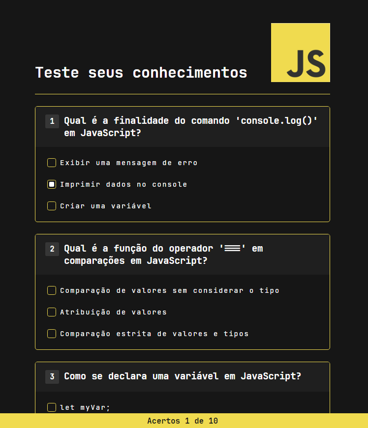

# Rocketseat HTML, CSS e JavaScript Project

### Projeto da Rocketseat NLW - HTML, CSS e JavaScript

Utilizei o **JavaScript** e colocar os inputs para funcionarem, criando dinamicamente um quiz interativo com perguntas e respostas, permitindo que o usuário selecione suas respostas e acompanhe o número de respostas corretas.

O Projeto utiliza:

- **HTML**
- **CSS**
- **JavaScript**

## Formulário

